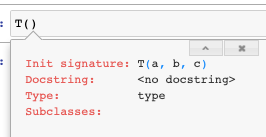
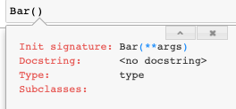
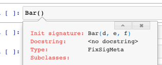

# Meta


<!-- WARNING: THIS FILE WAS AUTOGENERATED! DO NOT EDIT! -->

``` python
from fastcore.foundation import *
from nbdev.showdoc import *
from fastcore.nb_imports import *
from fastcore.test import *
```

These metaclasses customize object construction:

- [`FixSigMeta`](https://fastcore.fast.ai/meta.html#fixsigmeta)
  preserves the constructor signature for introspection and tab
  completion. The other metaclasses inherit from it.
- [`PrePostInitMeta`](https://fastcore.fast.ai/meta.html#prepostinitmeta)
  calls `__pre_init__` before `__init__` and `__post_init__` afterward.
- [`AutoInit`](https://fastcore.fast.ai/meta.html#autoinit) is a
  [`PrePostInitMeta`](https://fastcore.fast.ai/meta.html#prepostinitmeta)
  mixin that calls `super().__init__`.
- [`NewChkMeta`](https://fastcore.fast.ai/meta.html#newchkmeta) makes
  `C(x)` return `x` when `x` is already a `C` and there are no other
  arguments.
- [`BypassNewMeta`](https://fastcore.fast.ai/meta.html#bypassnewmeta)
  casts an object of `_bypass_type` to the new class without copying it.

See this [introduction to
metaclasses](https://realpython.com/python-metaclasses/) for background.

------------------------------------------------------------------------

<a
href="https://github.com/AnswerDotAI/fastcore/blob/main/fastcore/meta.py#L43"
target="_blank" style="float:right; font-size:smaller">source</a>

### test_sig

``` python
def test_sig(
    f, b
):
```

*Test the signature of an object*

``` python
def func_1(h,i,j): pass
def func_2(h,i=3, j=[5,6]): pass

class T:
    def __init__(self, a, b): pass

test_sig(func_1, '(h, i, j)')
test_sig(func_2, '(h, i=3, j=[5, 6])')
test_sig(T, '(a, b)')
```

------------------------------------------------------------------------

<a
href="https://github.com/AnswerDotAI/fastcore/blob/main/fastcore/meta.py#L55"
target="_blank" style="float:right; font-size:smaller">source</a>

### FixSigMeta

``` python
def FixSigMeta(
    *args, **kwargs
):
```

*A metaclass that fixes the signature on classes that override
`__new__`*

When you inherit from a class that defines `__new__`, or a metaclass
that defines `__call__`, the signature of your `__init__` method is
obfuscated such that tab completion no longer works.
[`FixSigMeta`](https://fastcore.fast.ai/meta.html#fixsigmeta) fixes this
issue and restores signatures.

To understand what
[`FixSigMeta`](https://fastcore.fast.ai/meta.html#fixsigmeta) does, it
is useful to inspect an object’s signature. You can inspect the
signature of an object with `inspect.signature`:

``` python
class T:
    def __init__(self, a, b, c): pass
    
inspect.signature(T)
```

    <Signature (a, b, c)>

This corresponds to tab completion working in the normal way:



However, when you inherhit from a class that defines `__new__` or a
metaclass that defines `__call__` this obfuscates the signature by
overriding your class with the signature of `__new__`, which prevents
tab completion from displaying useful information:

``` python
class Foo:
    def __new__(self, **args): pass

class Bar(Foo):
    def __init__(self, d, e, f): pass
    
inspect.signature(Bar)
```

    <Signature (d, e, f)>



Finally, the signature and tab completion can be restored by inheriting
from the metaclass
[`FixSigMeta`](https://fastcore.fast.ai/meta.html#fixsigmeta) as shown
below:

``` python
class Bar(Foo, metaclass=FixSigMeta):
    def __init__(self, d, e, f): pass
    
test_sig(Bar, '(d, e, f)')
inspect.signature(Bar)
```

    <Signature (d, e, f)>



For a metaclass that defines `__call__`, inherit from
[`FixSigMeta`](https://fastcore.fast.ai/meta.html#fixsigmeta) rather
than `type`. Leave `__new__` inherited from
[`FixSigMeta`](https://fastcore.fast.ai/meta.html#fixsigmeta):

``` python
class TestMeta(FixSigMeta):
    # __new__ comes from FixSigMeta
    def __call__(cls, *args, **kwargs): pass
    
class T(metaclass=TestMeta):
    def __init__(self, a, b): pass
    
test_sig(T, '(a, b)')
```

Without [`FixSigMeta`](https://fastcore.fast.ai/meta.html#fixsigmeta),
`T2` displays its metaclass’s `__call__` signature:

``` python
class GenericMeta(type):
    "A boilerplate metaclass that doesn't do anything for testing."
    def __new__(cls, name, bases, dict):
        return super().__new__(cls, name, bases, dict)
    def __call__(cls, *args, **kwargs): pass

class T2(metaclass=GenericMeta):
    def __init__(self, a, b): pass

# We can avoid this by inheriting from the metaclass `FixSigMeta`
test_sig(T2, '(*args, **kwargs)')
```

------------------------------------------------------------------------

<a
href="https://github.com/AnswerDotAI/fastcore/blob/main/fastcore/meta.py#L63"
target="_blank" style="float:right; font-size:smaller">source</a>

### PrePostInitMeta

``` python
def PrePostInitMeta(
    *args, **kwargs
):
```

*A metaclass that calls optional `__pre_init__` and `__post_init__`
methods*

`__pre_init__` and `__post_init__` are useful for initializing variables
or performing tasks prior to or after `__init__` being called,
respectively. Fore example:

``` python
class _T(metaclass=PrePostInitMeta):
    def __pre_init__(self):  self.a  = 0; 
    def __init__(self,b=0):  self.b = self.a + 1; assert self.b==1
    def __post_init__(self): self.c = self.b + 2; assert self.c==3

t = _T()
test_eq(t.a, 0) # set with __pre_init__
test_eq(t.b, 1) # set with __init__
test_eq(t.c, 3) # set with __post_init__
```

One use for
[`PrePostInitMeta`](https://fastcore.fast.ai/meta.html#prepostinitmeta)
is avoiding the `__super__().__init__()` boilerplate associated with
subclassing, such as used in
[`AutoInit`](https://fastcore.fast.ai/meta.html#autoinit).

------------------------------------------------------------------------

<a
href="https://github.com/AnswerDotAI/fastcore/blob/main/fastcore/meta.py#L74"
target="_blank" style="float:right; font-size:smaller">source</a>

### AutoInit

``` python
def AutoInit(
    *args, **kwargs
):
```

*Same as `object`, but no need for subclasses to call
`super().__init__`*

This is normally used as a
[mixin](https://www.residentmar.io/2019/07/07/python-mixins.html), eg:

``` python
class TestParent():
    def __init__(self): self.h = 10
        
class TestChild(AutoInit, TestParent):
    def __init__(self): self.k = self.h + 2
    
t = TestChild()
test_eq(t.h, 10) # h=10 is initialized in the parent class
test_eq(t.k, 12)
```

------------------------------------------------------------------------

<a
href="https://github.com/AnswerDotAI/fastcore/blob/main/fastcore/meta.py#L79"
target="_blank" style="float:right; font-size:smaller">source</a>

### NewChkMeta

``` python
def NewChkMeta(
    *args, **kwargs
):
```

*Metaclass to avoid recreating object passed to constructor*

[`NewChkMeta`](https://fastcore.fast.ai/meta.html#newchkmeta) is used
when an object of the same type is the first argument to your class’s
constructor (i.e. the `__init__` function), and you would rather it not
create a new object but point to the same exact object.

This is used in [`L`](https://fastcore.fast.ai/foundation.html#l), for
example, to avoid creating a new object when the object is already of
type [`L`](https://fastcore.fast.ai/foundation.html#l). This allows the
users to defenisvely instantiate an
[`L`](https://fastcore.fast.ai/foundation.html#l) object and just return
a reference to the same object if it already happens to be of type
[`L`](https://fastcore.fast.ai/foundation.html#l).

For example, the below class `_T` **optionally** accepts an object `o`
as its first argument. A new object is returned upon instantiation per
usual:

``` python
class _T():
    "Testing"
    def __init__(self, o): 
        # if `o` is not an object without an attribute `foo`, set foo = 1
        self.foo = getattr(o,'foo',1)
```

``` python
t = _T(3)
test_eq(t.foo,1) # 1 was not of type _T, so foo = 1

t2 = _T(t) #t1 is of type _T
assert t is not t2 # t1 and t2 are different objects
```

Now set `metaclass=NewChkMeta` to reuse an existing `_T`:

``` python
class _T(metaclass=NewChkMeta):
    "Testing with metaclass NewChkMeta"
    def __init__(self, o=None, b=1):
        # if `o` is not an object without an attribute `foo`, set foo = 1
        self.foo = getattr(o,'foo',1)
        self.b = b
```

We can now test `t` and `t2` are now pointing at the same object when
using this new definition of `_T`:

``` python
t = _T(3)
test_eq(t.foo,1) # 1 was not of type _T, so foo = 1

t2 = _T(t) # t2 will now reference t

test_is(t, t2) # t and t2 are the same object
t2.foo = 5 # this will also change t.foo to 5 because it is the same object
test_eq(t.foo, 5)
test_eq(t2.foo, 5)
```

Passing another argument creates a new object. Here, `_T(t, b=1)`
creates an object while `_T(t)` reuses `t`:

``` python
t3 = _T(t, b=1)
assert t3 is not t

t4 = _T(t) # without any arguments the constructor will return a reference to the same object
assert t4 is t
```

[`NewChkMeta`](https://fastcore.fast.ai/meta.html#newchkmeta) inherits
from [`FixSigMeta`](https://fastcore.fast.ai/meta.html#fixsigmeta),
preserving `_T`’s constructor signature:

``` python
test_sig(_T, '(o=None, b=1)')
```

------------------------------------------------------------------------

<a
href="https://github.com/AnswerDotAI/fastcore/blob/main/fastcore/meta.py#L87"
target="_blank" style="float:right; font-size:smaller">source</a>

### BypassNewMeta

``` python
def BypassNewMeta(
    *args, **kwargs
):
```

*Metaclass: casts `x` to this class if it’s of type `cls._bypass_type`*

[`BypassNewMeta`](https://fastcore.fast.ai/meta.html#bypassnewmeta) can
cast an existing object to the new class without copying it. Set
`_bypass_type` to the class of objects to reuse.

In NewChkMeta, objects of the same type passed to the constructor
(without arguments) would result into a new variable referencing the
same object. However, with
[`BypassNewMeta`](https://fastcore.fast.ai/meta.html#bypassnewmeta) this
only occurs if the type matches the `_bypass_type` of the class you are
defining:

``` python
class _TestA: pass
class _TestB: pass

class _T(_TestA, metaclass=BypassNewMeta):
    _bypass_type=_TestB
    def __init__(self,x): self.x=x
```

In the below example, `t` does not refer to `t2` because `t` is of type
`_TestA` while `_T._bypass_type` is of type `TestB`:

``` python
t = _TestA()
t2 = _T(t)
assert t is not t2
```

`_T(t)` reuses `t` when it is a `_TestB` instance. Both names then refer
to the same object, whose class is now `_T`:

``` python
t = _TestB()
t2 = _T(t)
t2.new_attr = 15

test_is(t, t2)
# since t2 just references t these will be the same
test_eq(t.new_attr, t2.new_attr)

# likewise, chaning an attribute on t will also affect t2 because they both point to the same object.
t.new_attr = 9
test_eq(t2.new_attr, 9)
```

## Metaprogramming

[`use_kwargs`](https://fastcore.fast.ai/meta.html#use_kwargs) and
[`use_kwargs_dict`](https://fastcore.fast.ai/meta.html#use_kwargs_dict)
replace `**kwargs` in a signature with parameters from a list or
dictionary.
[`funcs_kwargs`](https://fastcore.fast.ai/meta.html#funcs_kwargs) lets a
class accept method overrides as constructor arguments.

`@delegates(base)` adds `base`’s optional parameters to a wrapper’s
displayed signature for introspection and tab completion. Use
`keep=True` to retain `**kwargs` and `but` to exclude parameters. On a
class, `@delegates()` uses the superclass constructor:

------------------------------------------------------------------------

<a
href="https://github.com/AnswerDotAI/fastcore/blob/main/fastcore/meta.py#L97"
target="_blank" style="float:right; font-size:smaller">source</a>

### empty2none

``` python
def empty2none(
    p
):
```

*Replace `Parameter.empty` with `None`*

------------------------------------------------------------------------

<a
href="https://github.com/AnswerDotAI/fastcore/blob/main/fastcore/meta.py#L102"
target="_blank" style="float:right; font-size:smaller">source</a>

### anno_dict

``` python
def anno_dict(
    f
):
```

*`__annotation__ dictionary with`empty`cast to`None\`, returning empty
if doesn’t exist*

``` python
def _f(a:int, b:L)->str: ...
test_eq(anno_dict(_f), {'a': int, 'b': L, 'return': str})
```

------------------------------------------------------------------------

<a
href="https://github.com/AnswerDotAI/fastcore/blob/main/fastcore/meta.py#L110"
target="_blank" style="float:right; font-size:smaller">source</a>

### use_kwargs_dict

``` python
def use_kwargs_dict(
    keep:bool=False, **kwargs
):
```

*Decorator: replace `**kwargs` in signature with `names` params*

Replace all `**kwargs` with named arguments like so:

``` python
@use_kwargs_dict(y=1,z=None)
def foo(a, b=1, **kwargs): pass

test_sig(foo, '(a, b=1, *, y=1, z=None)')
```

Add named arguments, but optionally keep `**kwargs` by setting
`keep=True`:

``` python
@use_kwargs_dict(y=1,z=None, keep=True)
def foo(a, b=1, **kwargs): pass

test_sig(foo, '(a, b=1, *, y=1, z=None, **kwargs)')
```

------------------------------------------------------------------------

<a
href="https://github.com/AnswerDotAI/fastcore/blob/main/fastcore/meta.py#L123"
target="_blank" style="float:right; font-size:smaller">source</a>

### use_kwargs

``` python
def use_kwargs(
    names, keep:bool=False
):
```

*Decorator: replace `**kwargs` in signature with `names` params*

[`use_kwargs`](https://fastcore.fast.ai/meta.html#use_kwargs) is
different than
[`use_kwargs_dict`](https://fastcore.fast.ai/meta.html#use_kwargs_dict)
as it only replaces `**kwargs` with named parameters without any default
values:

``` python
@use_kwargs(['y', 'z'])
def foo(a, b=1, **kwargs): pass

test_sig(foo, '(a, b=1, *, y=None, z=None)')
```

You may optionally keep the `**kwargs` argument in your signature by
setting `keep=True`:

``` python
@use_kwargs(['y', 'z'], keep=True)
def foo(a, *args, b=1, **kwargs): pass
test_sig(foo, '(a, *args, b=1, y=None, z=None, **kwargs)')
```

The problem with this approach is the api for `foo` is obfuscated. Users
cannot introspect what the valid arguments for `**kwargs` are without
reading the source code. When a user tries tries to introspect the
signature of `foo`, they are presented with this:

``` python
inspect.signature(foo)
```

    <Signature (a, *args, b=1, y=None, z=None, **kwargs)>

[`_del_funcs`](https://fastcore.fast.ai/meta.html#_del_funcs) finds the
functions involved in delegation. A class delegates through its
constructor. Passing `None` selects the decorated class’s constructor
and its parent’s constructor.

``` python
def baz(a, b:int=2, c:int=3): return a + b + c

class Parent:
    def __init__(self, x, y=1): pass

class Child(Parent):
    def __init__(self, z, **kwargs): pass

to_f, from_f = _del_funcs(baz, lambda a, **kwargs: None)
print(f"Function->function: to_f={to_f.__name__}, from_f={from_f.__name__}")

to_f, from_f = _del_funcs(Parent, lambda a, **kwargs: None)
print(f"Class->function: to_f={to_f.__qualname__}, from_f={from_f.__name__}")

to_f, from_f = _del_funcs(None, Child)
print(f"None (parent): to_f={to_f.__qualname__}, from_f={from_f.__qualname__}")
```

    Function->function: to_f=baz, from_f=<lambda>
    Class->function: to_f=Parent.__init__, from_f=<lambda>
    None (parent): to_f=Parent.__init__, from_f=Child.__init__

This extracts just the params with defaults that aren’t already present:

``` python
sig = inspect.signature(lambda a, b=1, **kwargs: None)
s2 = _del_params(baz, sig)
print(f"Delegated params: {s2}")
print(f"Kinds: {[(k, v.kind.name) for k,v in s2.items()]}")
```

    Delegated params: {'c': <Parameter "c: int = 3">}
    Kinds: [('c', 'KEYWORD_ONLY')]

------------------------------------------------------------------------

<a
href="https://github.com/AnswerDotAI/fastcore/blob/main/fastcore/meta.py#L159"
target="_blank" style="float:right; font-size:smaller">source</a>

### delegates

``` python
def delegates(
    to:function=None, # Delegatee
    keep:bool=False, # Keep `kwargs` in decorated function?
    but:list=None, # Exclude these parameters from signature (list, or comma-separated str)
    sort_args:bool=False, # Sort arguments alphabetically, doesn't work with call_parse
):
```

*Decorator: replace `**kwargs` in signature with params from `to`*

``` python
def basefn(a, b=2, c=3): ...
@delegates(basefn)
def wrapper(d, **kwargs): ...
test_eq(str(inspect.signature(wrapper)), '(d, *, b=2, c=3)')
```

``` python
def baz(a, b:int=2, c:int=3): return a + b + c

def foo(c, a, **kwargs):
    return c + baz(a, **kwargs)

assert foo(c=1, a=1) == 7
```

We can address this issue by using the decorator
[`delegates`](https://fastcore.fast.ai/meta.html#delegates) to include
parameters from other functions. It also copies over the docstring from
the delegatee if the decorated function doesn’t have one. For example,
if we apply the
[`delegates`](https://fastcore.fast.ai/meta.html#delegates) decorator to
`foo` to include parameters from `baz`:

``` python
def baz(a, b:int=2, c:int=3):
    "Add three numbers"
    return a + b + c

@delegates(baz)
def foo(c, a, **kwargs): return c + baz(a, **kwargs)

test_sig(foo, '(c, a, *, b: int = 2)')
test_eq(foo.__doc__, 'Add three numbers')
inspect.signature(foo)
```

    <Signature (c, a, *, b: int = 2)>

We can optionally decide to keep `**kwargs` by setting `keep=True`:

``` python
@delegates(baz, keep=True)
def foo(c, a, **kwargs):
    return c + baz(a, **kwargs)

inspect.signature(foo)
```

    <Signature (c, a, *, b: int = 2, **kwargs)>

[`delegates`](https://fastcore.fast.ai/meta.html#delegates) copies
parameters that have default values. Here it copies `c`, but leaves out
the required parameters `e` and `d`:

``` python
def basefoo(e, d, c=2): pass

@delegates(basefoo)
def foo(a, b=1, **kwargs): pass
inspect.signature(foo) # e and d are not included b/c they don't have default parameters.
```

    <Signature (a, b=1, *, c=2)>

Declare required parameters explicitly in your function’s signature.

Use `but` to exclude optional parameters. Here we exclude `d`:

``` python
def basefoo(e, c=2, d=3): pass

@delegates(basefoo, but= ['d'])
def foo(a, b=1, **kwargs): pass

test_sig(foo, '(a, b=1, *, c=2)')
inspect.signature(foo)

@delegates(basefoo, but='c, d')
def foo2(a, b=1, **kwargs): pass

test_sig(foo2, '(a, b=1)')
```

You can also use
[`delegates`](https://fastcore.fast.ai/meta.html#delegates) between
methods in a class. Here is an example of
[`delegates`](https://fastcore.fast.ai/meta.html#delegates) with class
methods:

``` python
# example 1: class methods
class _T():
    @classmethod
    def foo(cls, a=1, b=2):
        pass
    
    @classmethod
    @delegates(foo)
    def bar(cls, c=3, **kwargs):
        pass

test_sig(_T.bar, '(c=3, *, a=1, b=2)')
```

Here is the same example with instance methods:

``` python
# example 2: instance methods
class _T():
    def foo(self, a=1, b=2):
        pass
    
    @delegates(foo)
    def bar(self, c=3, **kwargs):
        pass

t = _T()
test_sig(t.bar, '(c=3, *, a=1, b=2)')
```

You can also delegate between classes. By default, the
[`delegates`](https://fastcore.fast.ai/meta.html#delegates) decorator
will delegate to the superclass:

``` python
class BaseFoo:
    def __init__(self, e, c=2): pass

@delegates()# since no argument was passsed here we delegate to the superclass
class Foo(BaseFoo):
    def __init__(self, a, b=1, **kwargs): super().__init__(**kwargs)

test_sig(Foo, '(a, b=1, *, c=2)')
```

------------------------------------------------------------------------

<a
href="https://github.com/AnswerDotAI/fastcore/blob/main/fastcore/meta.py#L182"
target="_blank" style="float:right; font-size:smaller">source</a>

### method

``` python
def method(
    f
):
```

*Mark `f` as a method*

The [`method`](https://fastcore.fast.ai/meta.html#method) function is
used to change a function’s type to a method. In the below example we
change the type of `a` from a function to a method:

``` python
def a(x=2): return x + 1
assert type(a).__name__ == 'function'

a = method(a)
assert type(a).__name__ == 'method'
```

You can also sort the arguments by setting the `sort_args` parameter to
`True`. Here’s a function with arguments not in alphabetical order.

``` python
def unsortedfunc(c=3,a=1,b=2): pass
unsortedfunc
```

    <function __main__.unsortedfunc(c=3, a=1, b=2)>

We can sort them using the `sort_args` parameter:

``` python
@delegates(unsortedfunc, sort_args=True)
def sortedfunc(**kwargs): pass
test_sig(sortedfunc, '(*, a=1, b=2, c=3)')
sortedfunc
```

    <function __main__.sortedfunc(*, a=1, b=2, c=3)>

------------------------------------------------------------------------

<a
href="https://github.com/AnswerDotAI/fastcore/blob/main/fastcore/meta.py#L188"
target="_blank" style="float:right; font-size:smaller">source</a>

### delegated

``` python
def delegated(
    to:function=None, # Delegatee
    keep:bool=False, # Keep `kwargs` in decorated function?
    but:list=None, # Exclude these parameters from signature (list, or comma-separated str)
    sort_args:bool=False, # Sort arguments alphabetically, doesn't work with call_parse
):
```

*Like [`delegates`](https://fastcore.fast.ai/meta.html#delegates) but
also populates delegated default kwargs at call time*

``` python
@delegated(baz)
def foo(**kwargs): return kwargs

foo()
```

    {'b': 2, 'c': 3}

------------------------------------------------------------------------

<a
href="https://github.com/AnswerDotAI/fastcore/blob/main/fastcore/meta.py#L226"
target="_blank" style="float:right; font-size:smaller">source</a>

### funcs_kwargs

``` python
def funcs_kwargs(
    as_method:bool=False
):
```

*Replace methods in `cls._methods` with those from `kwargs`*

`@funcs_kwargs` lets you replace methods when creating an instance. List
their names in the class attribute `_methods` and accept `**kwargs` in
`__init__`.

By default, a replacement function becomes an instance attribute without
binding `self` or `cls`. Here, `T` allows a replacement for `b`:

``` python
@funcs_kwargs
class T:
    _methods=['b'] # allows you to add method b upon instantiation
    def __init__(self, f=1, **kwargs): pass # don't forget to include **kwargs in __init__
    def a(self): return 1
    def b(self): return 2
    
t = T()
test_eq(t.a(), 1)
test_eq(t.b(), 2)
```

[`funcs_kwargs`](https://fastcore.fast.ai/meta.html#funcs_kwargs) adds
the names in `_methods` to the constructor signature:

``` python
test_sig(T, '(f=1, *, b=None)')
inspect.signature(T)
```

    <Signature (f=1, *, b=None)>

You can now add the function `b` to class `T` upon instantiation:

``` python
def _new_func(): return 5

t = T(b = _new_func)
test_eq(t.b(), 5)
```

If you try to add a function with a name not listed in `_methods` it
will be ignored. In the below example, the attempt to add a function
named `a` is ignored:

``` python
t = T(a = lambda:3)
test_eq(t.a(), 1) # the attempt to add a is ignored and uses the original method instead.
```

A name in `_methods` does not need an existing method definition:

``` python
@funcs_kwargs
class T:
    _methods=['c']
    def __init__(self, f=1, **kwargs): pass

t = T(c = lambda: 4)
test_eq(t.c(), 4)
```

Use `@funcs_kwargs(as_method=True)` to bind the replacement function to
the instance. It can then access `self`:

``` python
def _f(self,a=1): return self.num + a # access the num attribute from the instance

@funcs_kwargs(as_method=True)
class T: 
    _methods=['b']
    num = 5
    
t = T(b = _f) # adds method b
test_eq(t.b(5), 10) # self.num + 5 = 10
```

Here is an example of how you might use this functionality with
inheritence:

``` python
def _f(self,a=1): return self.num * a #multiply instead of add 

class T2(T):
    def __init__(self,num):
        super().__init__(b = _f) # add method b from the super class
        self.num=num
        
t = T2(num=3)
test_eq(t.b(a=5), 15) # 3 * 5 = 15
test_sig(T2, '(num)')
```

------------------------------------------------------------------------

<a
href="https://github.com/AnswerDotAI/fastcore/blob/main/fastcore/meta.py#L232"
target="_blank" style="float:right; font-size:smaller">source</a>

### metadec

``` python
def metadec(
    d
):
```

*Decorator for decorators: make `d(f, *, ...)` usable as `@d` or
`@d(**params)`*

[`metadec`](https://fastcore.fast.ai/meta.html#metadec) lets a decorator
support both `@d` and `@d(option=value)`. Define the decorator with the
function first and keyword-only configuration parameters. A single
positional argument always denotes the function to decorate, even when a
configuration value is callable.

Fastcore uses it for
[`threaded`](https://fastcore.fast.ai/parallel.html#threaded),
[`startthread`](https://fastcore.fast.ai/parallel.html#startthread),
[`startproc`](https://fastcore.fast.ai/parallel.html#startproc) and
[`athreaded`](https://fastcore.fast.ai/aio.html#athreaded):

``` python
@metadec
def logcall(f, *, msg='calling'):
    "Print `msg` before each call to `f`"
    @wraps(f)
    def _f(*args, **kwargs):
        print(msg, f.__name__)
        return f(*args, **kwargs)
    return _f

@logcall
def add(a,b): return a+b

@logcall(msg='running')
def mul(a,b): return a*b

test_stdout(lambda: test_eq(add(1,2), 3), 'calling add')
test_stdout(lambda: test_eq(mul(3,4), 12), 'running mul')
```

[`metadec`](https://fastcore.fast.ai/meta.html#metadec) rejects
positional configuration parameters at definition time:

``` python
with expect_fail(AssertionError, contains='keyword-only'):
    @metadec
    def bad(f, flag=False): return f
```

------------------------------------------------------------------------

<a
href="https://github.com/AnswerDotAI/fastcore/blob/main/fastcore/meta.py#L243"
target="_blank" style="float:right; font-size:smaller">source</a>

### splice_sig

``` python
def splice_sig(
    wrapper, fn, *skips
):
```

*Replace `*args`/`**kwargs` in wrapper’s sig with fn’s params (minus
skips)*

[`splice_sig`](https://fastcore.fast.ai/meta.html#splice_sig) builds a
wrapper’s signature from its own parameters and those of the wrapped
function. Use it for decorators that add parameters such as `id`,
`dname` or `verbose`.

Put `*args` and `**kwargs` where the wrapped function’s parameters
belong:

``` python
def wrapper(id, *args, dname='', **kw): ...
```

`splice_sig(wrapper, fn, *skips)` combines parameters in this order:

1.  The wrapper’s parameters before `*args`.
2.  The parameters from `fn`, excluding `skips`.
3.  The wrapper’s keyword-only parameters.

Use `skips` for arguments supplied by the wrapper, such as the text
passed to an editor.
[`splice_sig`](https://fastcore.fast.ai/meta.html#splice_sig) also
applies `wraps(fn)` to preserve the function’s name, docstring and other
metadata.

*Simple logging decorator:*

``` python
def logged(fn):
    "Add verbose flag that logs input/output"
    def wrapper(text, *args, verbose=False, **kw):
        result = fn(text, *args, **kw)
        if verbose: print(f'{fn.__name__}({text!r}) → {result!r}')
        return result
    return splice_sig(wrapper, fn, 'text')

@logged
def shout(text, times=1):
    "Uppercase and repeat"
    return text.upper() * times
```

``` python
shout('hi', 2, verbose=True)
```

    shout('hi') → 'HIHI'

    'HIHI'

The signature combines the function and the wrapper:

``` python
shout?
```

``` python
def shout(
    text, times:int=1, verbose:bool=False
):
    "Uppercase and repeat"
```

**File:** `~/aai-ws/fastcore/nbs/<ipython-input-1-a0305bf44988>`; line:
9

**Type:** function

*API client wrapper:*

``` python
def api_call(fn):
    "Decorator adding auth and retry params to API transform functions"
    def wrapper(endpoint, *args, auth_token=None, retries=3, **kw):
        for attempt in range(retries):
            resp = httpx.get(endpoint, headers={'Authorization': auth_token})
            if resp.ok: break
        return fn(resp.json(), *args, **kw)
    return splice_sig(wrapper, fn, 'data',)

@api_call
def extract_ids(data, key='id'):
    "Get `key` value from items in `data['results']`"
    return [item[key] for item in data.get('results', [])]
```

``` python
extract_ids?
```

``` python
def extract_ids(
    endpoint, key:str='id', auth_token:NoneType=None, retries:int=3
):
    "Get `key` value from items in `data['results']`"
```

**File:** `~/aai-ws/fastcore/nbs/<ipython-input-1-12750f681b4a>`; line:
10

**Type:** function

[`splice_sig`](https://fastcore.fast.ai/meta.html#splice_sig) also works
when `fn` carries its own `__signature__`, such as a
`@delegates`-decorated function:

``` python
def _extra(color:str='red'): return color
@delegates(_extra)
def _sized(text, size=1, **kwargs): return text*size

def _loud(fn):
    def wrapper(text, *args, exclaim=False, **kw): return fn(text, *args, **kw)
    return splice_sig(wrapper, fn, 'text')

test_sig(_loud(_sized), "(text, size=1, *, color: str = 'red', exclaim=False)")
```

A `**kwargs` parameter from `fn` appears after the wrapper’s
keyword-only parameters:

``` python
def _sized_kw(text, size=1, **kwargs): return text*size

test_sig(_loud(_sized_kw), "(text, size=1, *, exclaim=False, **kwargs)")
```
