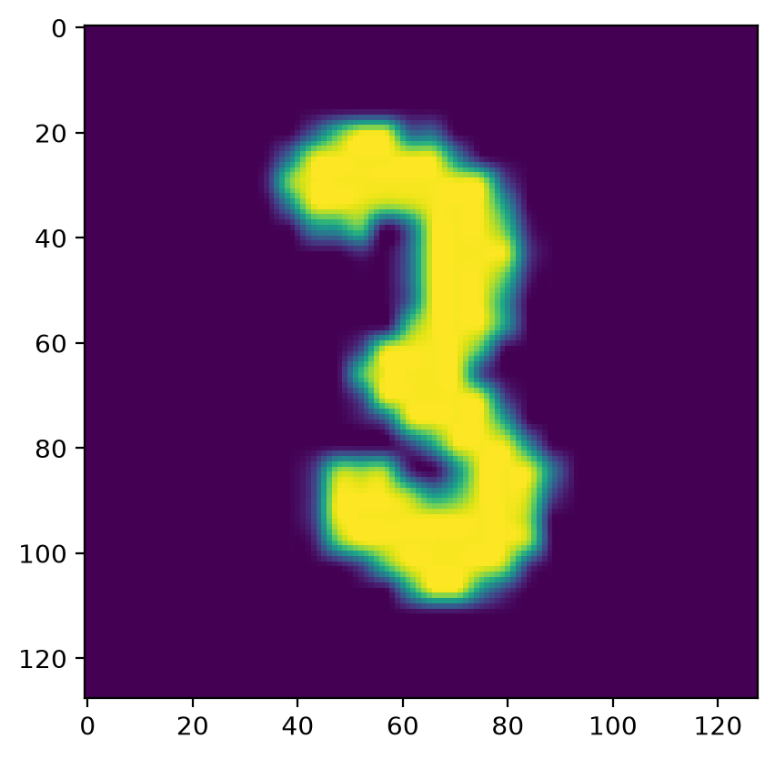

# Test


<!-- WARNING: THIS FILE WAS AUTOGENERATED! DO NOT EDIT! -->

All the helpers here wrap `test(a,b,cmp)`: an `assert cmp(a,b)` that
shows both values when the comparison fails, rather than a bare
`AssertionError`. The named comparisons are
[`test_eq`](https://fastcore.fast.ai/test.html#test_eq),
[`test_ne`](https://fastcore.fast.ai/test.html#test_ne),
[`test_eq_type`](https://fastcore.fast.ai/test.html#test_eq_type) (equal
and same type),
[`test_close`](https://fastcore.fast.ai/test.html#test_close) (within
`eps`, default 1e-5),
[`test_is`](https://fastcore.fast.ai/test.html#test_is),
[`test_shuffled`](https://fastcore.fast.ai/test.html#test_shuffled)
(equal ignoring order),
[`test_stdout`](https://fastcore.fast.ai/test.html#test_stdout) (what
`f` prints), and
[`test_warns`](https://fastcore.fast.ai/test.html#test_warns).

## Simple test functions

To check that code fails as expected, use
`test_fail(f, contains=..., exc=...)` for a callable, or
[`expect_fail`](https://fastcore.fast.ai/test.html#expect_fail) as a
context manager, which also accepts `regex`:

------------------------------------------------------------------------

<a
href="https://github.com/AnswerDotAI/fastcore/blob/main/fastcore/test.py#L43"
target="_blank" style="float:right; font-size:smaller">source</a>

### test_fail

``` python
def test_fail(
    f, msg:str='', contains:str='', exc:type=Exception, args:NoneType=None, kwargs:NoneType=None
):
```

*Fails with `msg` unless `f()` raises an exception of type `exc` and
(optionally) has `contains` in `e.args`;
[`expect_fail`](https://fastcore.fast.ai/test.html#expect_fail) is
normally preferred*

``` python
def _fail(): raise Exception("foobar")
test_fail(_fail, contains="foo")

def _fail(): raise Exception()
test_fail(_fail)

def _fail(): raise ValueError()
test_fail(_fail, exc=ValueError)
test_fail(lambda: test_fail(_fail, exc=IndexError), exc=AssertionError)
```

We can also pass `args` and `kwargs` to function to check if it fails
with special inputs.

``` python
def _fail_args(a):
    if a == 5: raise ValueError
test_fail(_fail_args, args=(5,))
test_fail(_fail_args, kwargs=dict(a=5))
```

------------------------------------------------------------------------

<a
href="https://github.com/AnswerDotAI/fastcore/blob/main/fastcore/test.py#L55"
target="_blank" style="float:right; font-size:smaller">source</a>

### expect_fail

``` python
def expect_fail(
    exc:type=Exception, contains:str='', msg:str='', regex:str=''
):
```

*Context manager that fails with `msg` unless body raises `exc`,
optionally containing `contains` or matching `regex`*

[`expect_fail`](https://fastcore.fast.ai/test.html#expect_fail) is
similar to [`test_fail`](https://fastcore.fast.ai/test.html#test_fail),
but is a context manager:

``` python
with expect_fail(contains="foo"): raise Exception("foobar")
with expect_fail(ValueError): raise ValueError()

# `msg` is included when the check fails: no exception raised, or `contains` not found
with expect_fail(AssertionError, 'no boom'):
    with expect_fail(msg='no boom'): 1+1
with expect_fail(AssertionError, 'wrong text'):
    with expect_fail(contains='foo', msg='wrong text'): raise Exception('bar')

# `regex` is like `contains`, but a regular expression
with expect_fail(regex=r'fo+bar'): raise Exception('foobar')
with expect_fail(AssertionError, 'wrong pat'):
    with expect_fail(regex=r'^bar', msg='wrong pat'): raise Exception('foobar')
```

``` python
def _fail(): raise ValueError('oops')
test_fail(_fail, contains='oops')
with expect_fail(ValueError, regex='o+ps'): _fail()
```

------------------------------------------------------------------------

<a
href="https://github.com/AnswerDotAI/fastcore/blob/main/fastcore/test.py#L65"
target="_blank" style="float:right; font-size:smaller">source</a>

### test

``` python
def test(
    a, b, cmp, cname:NoneType=None
):
```

*`assert` that `cmp(a,b)`; display inputs and `cname or cmp.__name__` if
it fails*

``` python
test([1,2],[1,2], operator.eq)
test_fail(lambda: test([1,2],[1], operator.eq))
test([1,2],[1],   operator.ne)
test_fail(lambda: test([1,2],[1,2], operator.ne))
```

`cmp` can be any callable, and fastcore’s curried operators
([`in_`](https://fastcore.fast.ai/basics.html#in_), `gt`, `is_`, and
friends from `fastcore.basics`) make good ones: `test(x, valid, in_)`
beats a bare `assert x in valid` by showing both values when it fails:

``` python
from fastcore.basics import in_
```

``` python
test(2, [1,2,3], in_)
test('b', 'abc', in_)
```

------------------------------------------------------------------------

### all_equal

``` python
def all_equal(
    a, b
):
```

*Compares whether `a` and `b` are the same length and have the same
contents*

``` python
test(['abc'], ['abc'], all_equal)
test_fail(lambda: test(['abc'],['cab'], all_equal))
```

------------------------------------------------------------------------

### equals

``` python
def equals(
    a, b
):
```

*Compares `a` and `b` for equality; supports sublists, tensors and
arrays too*

``` python
test([['abc'],['a']], [['abc'],['a']],  equals)
test([['abc'],['a'],'b', [['x']]], [['abc'],['a'],'b', [['x']]],  equals) # supports any depth and nested structure
```

------------------------------------------------------------------------

<a
href="https://github.com/AnswerDotAI/fastcore/blob/main/fastcore/test.py#L71"
target="_blank" style="float:right; font-size:smaller">source</a>

### nequals

``` python
def nequals(
    a, b
):
```

*Compares `a` and `b` for `not equals`*

``` python
test(['abc'], ['ab' ], nequals)
```

## test_eq test_ne, etc…

Just use
[`test_eq`](https://fastcore.fast.ai/test.html#test_eq)/[`test_ne`](https://fastcore.fast.ai/test.html#test_ne)
to test for `==`/`!=`.
[`test_eq_type`](https://fastcore.fast.ai/test.html#test_eq_type) checks
things are equal and of the same type. We define them using
[`test`](https://fastcore.fast.ai/test.html#test):

------------------------------------------------------------------------

<a
href="https://github.com/AnswerDotAI/fastcore/blob/main/fastcore/test.py#L76"
target="_blank" style="float:right; font-size:smaller">source</a>

### test_eq

``` python
def test_eq(
    a, b
):
```

*[`test`](https://fastcore.fast.ai/test.html#test) that `a==b`*

``` python
test_eq([1,2],[1,2])
test_eq([1,2],map(int,[1,2]))
test_eq(array([1,2]),array([1,2]))
test_eq([array([1,2]),3],[array([1,2]),3])
test_eq(dict(a=1,b=2), dict(b=2,a=1))
test_fail(lambda: test_eq([1,2], 1), contains="==")
test_fail(lambda: test_eq(None, np.array([1,2])), contains="==")
test_eq({'a', 'b', 'c'}, {'c', 'a', 'b'})
```

[`test_eq`](https://fastcore.fast.ai/test.html#test_eq) compares with
`equals`, which works by content across types: generators are consumed,
and lists, tuples, sets, dicts, numpy arrays, torch tensors, and
DataFrames all compare their contents, including mixed cases like an
array against a plain list:

``` python
test_eq([1,2], map(int,[1,2]))
test_eq(array([1,2]), [1,2])
test_eq(dict(a=1,b=2), dict(b=2,a=1))
```

``` python
df1 = pd.DataFrame(dict(a=[1,2],b=['a','b']))
df2 = pd.DataFrame(dict(a=[1,2],b=['a','b']))
df3 = pd.DataFrame(dict(a=[1,2],b=['a','c']))

test_eq(df1,df2)
test_eq(df1.a,df2.a)
test_fail(lambda: test_eq(df1,df3), contains='==')
class T(pd.Series): pass
test_eq(df1.iloc[0], T(df2.iloc[0])) # works with subclasses
```

``` python
test_eq(torch.zeros(10), torch.zeros(10, dtype=torch.float64))
test_eq(torch.zeros(10), torch.ones(10)-1)
test_fail(lambda:test_eq(torch.zeros(10), torch.ones(1, 10)), contains='==')
test_eq(torch.zeros(3), [0,0,0])
```

------------------------------------------------------------------------

<a
href="https://github.com/AnswerDotAI/fastcore/blob/main/fastcore/test.py#L81"
target="_blank" style="float:right; font-size:smaller">source</a>

### test_eq_type

``` python
def test_eq_type(
    a, b
):
```

*[`test`](https://fastcore.fast.ai/test.html#test) that `a==b` and are
same type*

``` python
test_eq_type(1,1)
test_fail(lambda: test_eq_type(1,1.))
test_eq_type([1,1],[1,1])
test_fail(lambda: test_eq_type([1,1],(1,1)))
test_fail(lambda: test_eq_type([1,1],[1,1.]))
```

------------------------------------------------------------------------

<a
href="https://github.com/AnswerDotAI/fastcore/blob/main/fastcore/test.py#L88"
target="_blank" style="float:right; font-size:smaller">source</a>

### test_ne

``` python
def test_ne(
    a, b
):
```

*[`test`](https://fastcore.fast.ai/test.html#test) that `a!=b`*

``` python
test_ne([1,2],[1])
test_ne([1,2],[1,3])
test_ne(array([1,2]),array([1,1]))
test_ne(array([1,2]),array([1,1]))
test_ne([array([1,2]),3],[array([1,2])])
test_ne([3,4],array([3]))
test_ne([3,4],array([3,5]))
test_ne(dict(a=1,b=2), ['a', 'b'])
test_ne(['a', 'b'], dict(a=1,b=2))
```

------------------------------------------------------------------------

<a
href="https://github.com/AnswerDotAI/fastcore/blob/main/fastcore/test.py#L93"
target="_blank" style="float:right; font-size:smaller">source</a>

### is_close

``` python
def is_close(
    a, b, eps:float=1e-05
):
```

*Is `a` within `eps` of `b`*

------------------------------------------------------------------------

<a
href="https://github.com/AnswerDotAI/fastcore/blob/main/fastcore/test.py#L104"
target="_blank" style="float:right; font-size:smaller">source</a>

### test_close

``` python
def test_close(
    a, b, eps:float=1e-05
):
```

*[`test`](https://fastcore.fast.ai/test.html#test) that `a` is within
`eps` of `b`*

``` python
test_close(1,1.001,eps=1e-2)
test_fail(lambda: test_close(1,1.001))
test_close([-0.001,1.001], [0.,1.], eps=1e-2)
test_close(np.array([-0.001,1.001]), np.array([0.,1.]), eps=1e-2)
test_close(array([-0.001,1.001]), array([0.,1.]), eps=1e-2)
test_close(['a','b'], ['a','b'])
test_fail(lambda: test_close(['a','b'], ['a','c']))
```

------------------------------------------------------------------------

<a
href="https://github.com/AnswerDotAI/fastcore/blob/main/fastcore/test.py#L109"
target="_blank" style="float:right; font-size:smaller">source</a>

### test_is

``` python
def test_is(
    a, b
):
```

*[`test`](https://fastcore.fast.ai/test.html#test) that `a is b`*

``` python
test_fail(lambda: test_is([1], [1]))
a = [1]
test_is(a, a)
b = [2]; test_fail(lambda: test_is(a, b))
```

------------------------------------------------------------------------

<a
href="https://github.com/AnswerDotAI/fastcore/blob/main/fastcore/test.py#L114"
target="_blank" style="float:right; font-size:smaller">source</a>

### test_shuffled

``` python
def test_shuffled(
    a, b
):
```

*[`test`](https://fastcore.fast.ai/test.html#test) that `a` and `b` are
shuffled versions of the same sequence of items*

``` python
a = list(range(50))
b = copy(a)
random.shuffle(b)
test_shuffled(a,b)
test_fail(lambda:test_shuffled(a,a))
```

``` python
a = 'abc'
b = 'abcabc'
test_fail(lambda:test_shuffled(a,b))
```

``` python
a = ['a', 42, True] 
b = [42, True, 'a']
test_shuffled(a,b)
```

------------------------------------------------------------------------

<a
href="https://github.com/AnswerDotAI/fastcore/blob/main/fastcore/test.py#L120"
target="_blank" style="float:right; font-size:smaller">source</a>

### test_stdout

``` python
def test_stdout(
    f, exp, regex:bool=False
):
```

*Test that `f` prints `exp` to stdout, optionally checking as `regex`*

``` python
test_stdout(lambda: print('hi'), 'hi')
test_fail(lambda: test_stdout(lambda: print('hi'), 'ho'))
test_stdout(lambda: 1+1, '')
test_stdout(lambda: print('hi there!'), r'^hi.*!$', regex=True)
```

------------------------------------------------------------------------

<a
href="https://github.com/AnswerDotAI/fastcore/blob/main/fastcore/test.py#L128"
target="_blank" style="float:right; font-size:smaller">source</a>

### test_warns

``` python
def test_warns(
    f, show:bool=False
):
```

*Call self as a function.*

``` python
test_warns(lambda: warnings.warn("Oh no!"))
test_fail(lambda: test_warns(lambda: 2+2), contains='No warnings raised')
```

``` python
test_warns(lambda: warnings.warn("Oh no!"), show=True)
```

    <class 'UserWarning'>: Oh no!

``` python
im = Image.open(TEST_IMAGE).resize((128,128)); im
```


``` python
im = Image.open(TEST_IMAGE_BW).resize((128,128)); im
```


------------------------------------------------------------------------

<a
href="https://github.com/AnswerDotAI/fastcore/blob/main/fastcore/test.py#L142"
target="_blank" style="float:right; font-size:smaller">source</a>

### test_fig_exists

``` python
def test_fig_exists(
    ax
):
```

*Test there is a figure displayed in `ax`*

``` python
fig,ax = plt.subplots()
ax.imshow(array(im));
```



``` python
test_fig_exists(ax)
```

------------------------------------------------------------------------

<a
href="https://github.com/AnswerDotAI/fastcore/blob/main/fastcore/test.py#L152"
target="_blank" style="float:right; font-size:smaller">source</a>

### ExceptionExpected

``` python
def ExceptionExpected(
    ex:type=Exception, regex:str=''
):
```

*Context manager that tests if an exception is raised. Deprecated: use
[`expect_fail`](https://fastcore.fast.ai/test.html#expect_fail) instead*

``` python
def _tst_1(): assert False, "This is a test"
def _tst_2(): raise SyntaxError

with ExceptionExpected(): _tst_1()
with ExceptionExpected(ex=AssertionError, regex="This is a test"): _tst_1()
with ExceptionExpected(ex=SyntaxError): _tst_2()
```

`exception` is an abbreviation for
[`ExceptionExpected()`](https://fastcore.fast.ai/test.html#exceptionexpected).

``` python
with exception: _tst_1()
```
